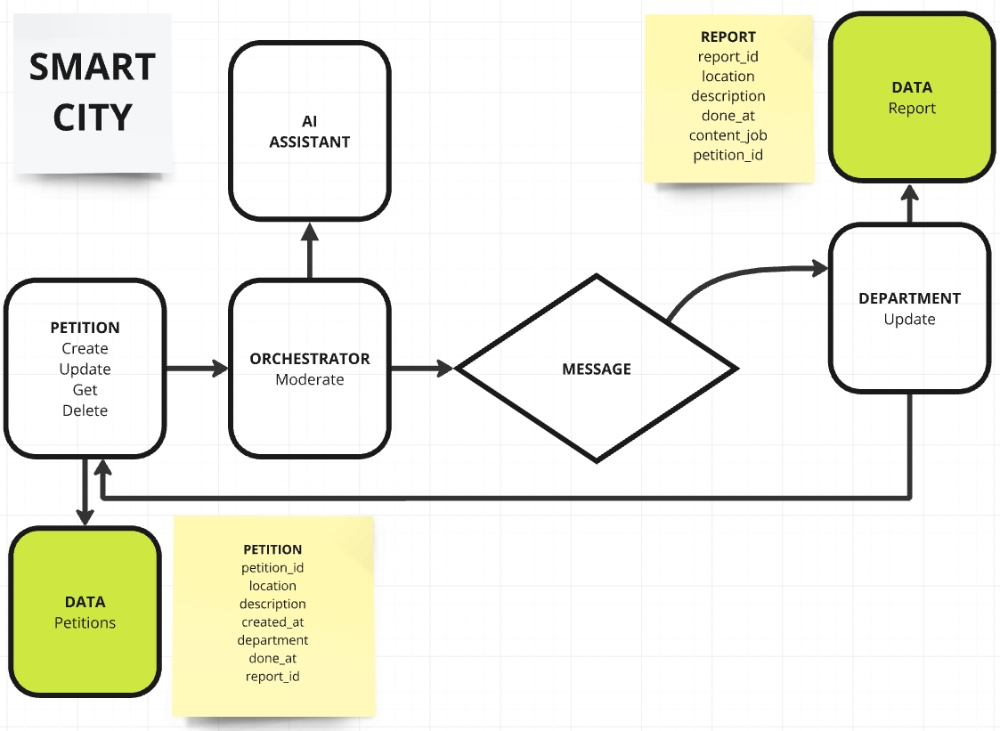

## Run project:
1. Install or update 
[Git](https://git-scm.com/downloads)
[Docker](https://docs.docker.com/engine/install/)
2. Get the source code
```
git clone https://github.com/Levp808/Smartcity.git
```
3. Change the directory
```
cd smartcity
```
4. Run
```
make run
```
The project starts at 0.0.0.0:50049

5. Stop
```
make stop
```
## How it work:
1. The user creates a petition in the **Petition Service**, which then forwards it to the **Orchestrator Service** for moderation.

2. The **Orchestrator Service** reviews the petition description and determines the appropriate department using an AI assistant.

3. Once the department is identified, the **Orchestrator Service** returns the department name to the **Petition Service**.  
   If the department name cannot be determined, the **Petition Service** deletes the petition.

4. The **Orchestrator Service** sends the petition to a message broker, categorized by topics for different **Department Services**.

5. The **Department Service** consumes the message, creates a report, and updates the report ID in the **Petition Service**.

6. The user submits a request to the **Department Service** to update the fields for job details and the completion time of the petition using the report ID.

7. The **Department Service** then calls the corresponding update endpoint in the **Petition Service** to synchronize the changes.



## How to Test
1. Launch **Postman**.  
2. Import the proto file from the path `./api/petition_v1/petition.proto`.  
3. Enter the address `0.0.0.0:50049`.  
4. Select the method `Petition/CreatePetition`.  
5. Use the test cases.  

### Test Cases

### Case 1
```json
{
    "description": "На перекрёстке улиц Маяковская и Лазо сломался светофор",
    "location": "Маяковская 32"
}
```

### Case 2
```json
{
    "description": "Свет не работает в подъезде 12 на улице Комсомольская 25",
    "location": "Комсомольская 25"
}
```

### Case 3
```json
{
    "description": "jfafs 12526%№;№ енуиаура",
    "location": "jfafs 12526%№;№ енуиаура"
}
